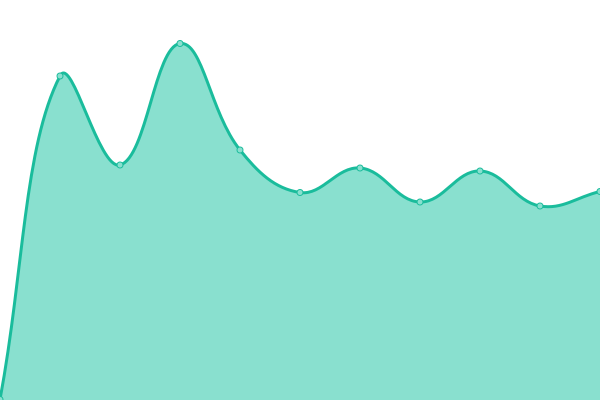

# [📈 Live Status](https://status.home.kaki87.net): <!--live status--> **🟩 All systems operational**

This repository contains the open-source uptime monitor and status page for [server-home-KaKi87](https://status.home.kaki87.net), powered by [Upptime](https://github.com/upptime/upptime).

With [Upptime](https://upptime.js.org), you can get your own unlimited and free uptime monitor and status page, powered entirely by a GitHub repository. We use [Issues](https://github.com/server-home-KaKi87/status/issues) as incident reports, [Actions](https://github.com/server-home-KaKi87/status/actions) as uptime monitors, and [Pages](https://status.home.kaki87.net) for the status page.

<!--start: status pages-->
<!-- This summary is generated by Upptime (https://github.com/upptime/upptime) -->
<!-- Do not edit this manually, your changes will be overwritten -->
<!-- prettier-ignore -->
| URL | Status | History | Response Time | Uptime |
| --- | ------ | ------- | ------------- | ------ |
|  [Instagram API](https://ig-api.home.kaki87.net) | 🟩 Up | [instagram-api.yml](https://github.com/server-home-KaKi87/status/commits/HEAD/history/instagram-api.yml) | 

 560ms
     
 | 

<a href="https://status.home.kaki87.net/history/instagram-api">99.76%</a>
    

<!--end: status pages-->

[**Visit our status website →**](https://status.home.kaki87.net)

## 📄 License

- Powered by: [Upptime](https://github.com/upptime/upptime)
- Code: [MIT](./LICENSE) © [server-home-KaKi87](https://status.home.kaki87.net)
- Data in the `./history` directory: [Open Database License](https://opendatacommons.org/licenses/odbl/1-0/)
