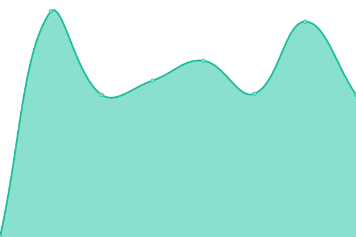
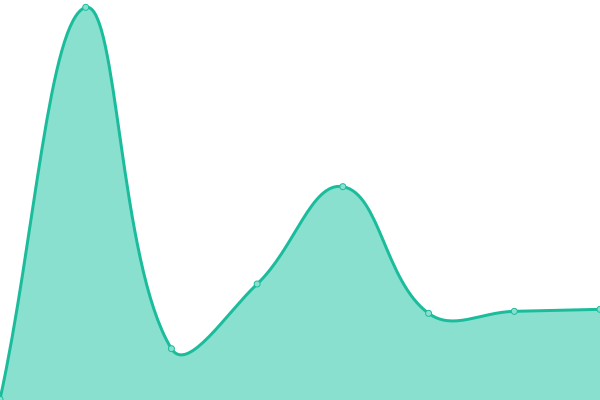
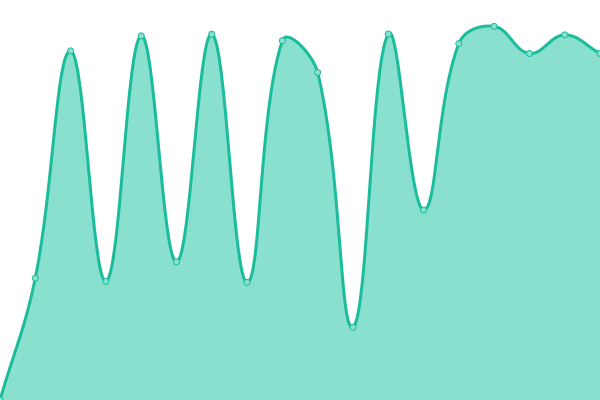

# [📈 Live Status](https://status.home.kaki87.net): <!--live status--> **🟧 Partial outage**

This repository contains the open-source uptime monitor and status page for [server-home-KaKi87](https://status.home.kaki87.net), powered by [Upptime](https://github.com/upptime/upptime).

With [Upptime](https://upptime.js.org), you can get your own unlimited and free uptime monitor and status page, powered entirely by a GitHub repository. We use [Issues](https://github.com/server-home-KaKi87/status/issues) as incident reports, [Actions](https://github.com/server-home-KaKi87/status/actions) as uptime monitors, and [Pages](https://status.home.kaki87.net) for the status page.

<!--start: status pages-->
<!-- This summary is generated by Upptime (https://github.com/upptime/upptime) -->
<!-- Do not edit this manually, your changes will be overwritten -->
<!-- prettier-ignore -->
| URL | Status | History | Response Time | Uptime |
| --- | ------ | ------- | ------------- | ------ |
|  [Box](https://box.home.kaki87.net) | 🟥 Down | [box.yml](https://github.com/server-home-KaKi87/status/commits/HEAD/history/box.yml) | 

 938ms
     
 | 

<a href="https://status.home.kaki87.net/history/box">99.97%</a>
    

|  [AdGuard](https://adguard.home.kaki87.net) | 🟥 Down | [ad-guard.yml](https://github.com/server-home-KaKi87/status/commits/HEAD/history/ad-guard.yml) | 

 862ms
     
 | 

<a href="https://status.home.kaki87.net/history/ad-guard">99.98%</a>
    

|  [Dashboard](https://dashboard.home.kaki87.net) | 🟥 Down | [dashboard.yml](https://github.com/server-home-KaKi87/status/commits/HEAD/history/dashboard.yml) | 

 754ms
     
 | 

<a href="https://status.home.kaki87.net/history/dashboard">0.00%</a>
    

|  Home Cinema - Discord bot | 🟩 Up | [home-cinema-discord-bot.yml](https://github.com/server-home-KaKi87/status/commits/HEAD/history/home-cinema-discord-bot.yml) | 

 134ms
     
 | 

<a href="https://status.home.kaki87.net/history/home-cinema-discord-bot">99.75%</a>
    

|  [Home Assistant](https://assistant.home.kaki87.net) | 🟥 Down | [home-assistant.yml](https://github.com/server-home-KaKi87/status/commits/HEAD/history/home-assistant.yml) | 

 749ms
     
 | 

<a href="https://status.home.kaki87.net/history/home-assistant">99.99%</a>
    

|  [kakilogy](https://kakilo.gy) | 🟥 Down | [kakilogy.yml](https://github.com/server-home-KaKi87/status/commits/HEAD/history/kakilogy.yml) | 

 1362ms
     
 | 

<a href="https://status.home.kaki87.net/history/kakilogy">99.99%</a>
    

|  [Speedtest tracker](https://speedtest.home.kaki87.net) | 🟥 Down | [speedtest-tracker.yml](https://github.com/server-home-KaKi87/status/commits/HEAD/history/speedtest-tracker.yml) | 

 2788ms
     
 | 

<a href="https://status.home.kaki87.net/history/speedtest-tracker">100.00%</a>
    

<!--end: status pages-->

[**Visit our status website →**](https://status.home.kaki87.net)

## 📄 License

- Powered by: [Upptime](https://github.com/upptime/upptime)
- Code: [MIT](./LICENSE) © [server-home-KaKi87](https://status.home.kaki87.net)
- Data in the `./history` directory: [Open Database License](https://opendatacommons.org/licenses/odbl/1-0/)
